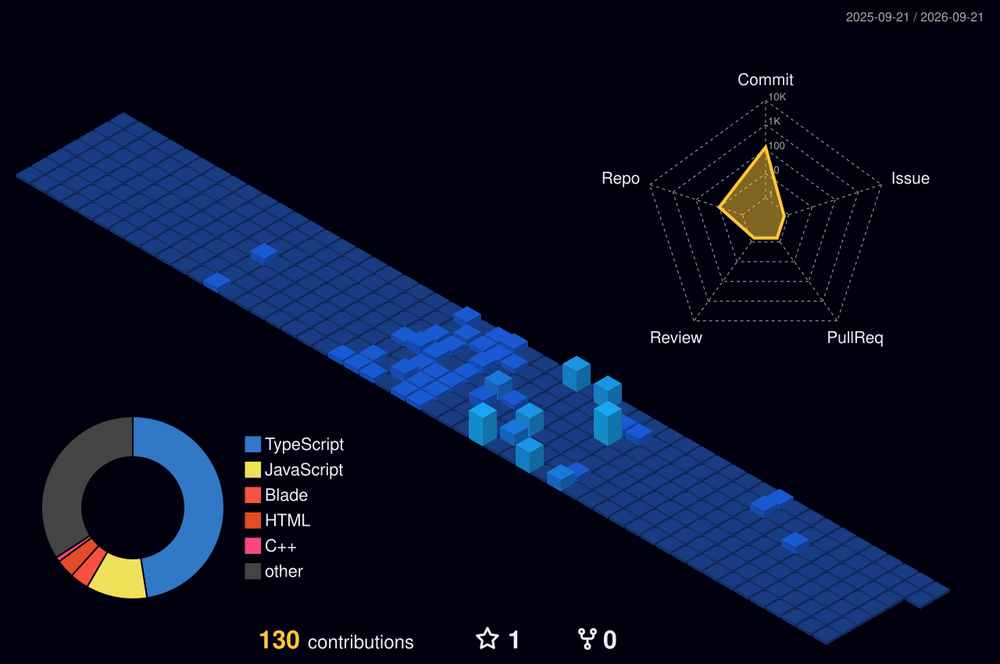

# 🌌 Welcome to my Digital Space

  

---

### 🚀 About Me
I'm a Full Stack Developer passionate about building high-performance, visually stunning web applications. Currently, I'm working on **EscrowFlow**, a secure payment platform for freelancers and clients.

- 🔭 I’m currently working on **EscrowFlow**
- ⚡ Fun fact: I love high-end UI/UX design and 3D graphics.
- 📫 How to reach me: **kg35657@gmail.com**

---

### 📊 Elite Performance Metrics

  

  
  

---

### 🏙️ 3D Contribution Skyline
*This city grows as I commit code! (Looping Animation)*

  

---

### 🛠️ Tech Stack

  
  
  
  
  
  

